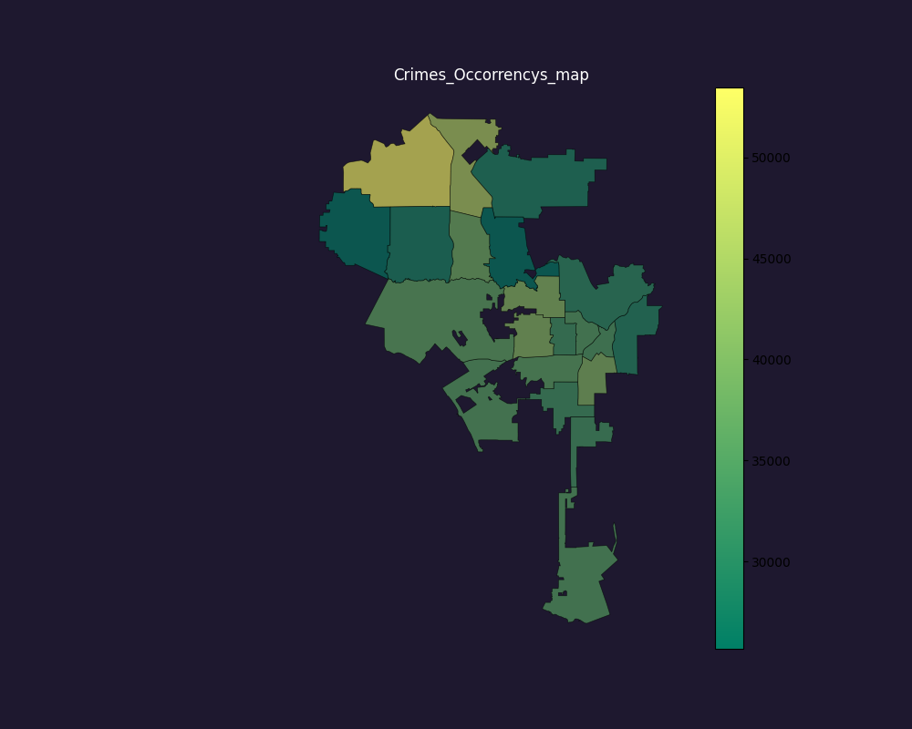

Hypothesis one - Crime & location
=================================

A distribuição de crimes por LAPD é desigual entre as regiões. Há crimes
que são mais frequentes em determinadas regiões, e há regiões mais 
"perigosas" que outras.

Method
======

Com a hipótese de que a distribuição da ocorrência de crimes em Los Angeles é desigual, 
bem como a segurança de cada região, foi feita a análise dos dados dos boletins de ocorrência
emitidos entre 2020 e 2023 nos 21 LAPD.

Devido a grande variedade de tipos de crimes existentes, os mesmos foram categorizados
com o objetivo de facilitar a análise e mostragem dos dados. Os crimes foram separados em
três categorias de acordo com sua gravidade, sendo elas "baixa", que representam crimes pequenos
como furtos leves, "média", que representam crimes significamente mais graves como grandes furtos e
agressões, e "alta", que são crimes os com gravidade mais elevada, como os crimes hediondos.

Para análise e mostragem dos dados, foram utilizados três tipos diferentes de gráficos, gráficos de barras, 
gráficos de calor e mapas de calor geográfico, bem como uma base de dados extra para plotar o mapa de Los Angeles
com as fronteiras dos departamentos policiais.

A análise considerou apenas aspectos quantitativos em relação as ocorrências, filtrando pelos crimes que ocorreram pelo
menos uma vez em cada região. Os gráficos "Crimes mais frequentes", e "Crimes po região", mostram os crimes que mais 
foram relatados e as quantidade total de ocorrências por região.Nota-se que apesar do crime '510' ser o mais frequentes,
ele não é o que mais ocorre na região "Central", que é a região com maior número de ocorrências. Isso mostra que a distribuição 
dos crimes pode não ser simplesmente proporcional, podendo estar condicionada a outros fatores, como históricos e geográficos.

Ainda foi feito de uma análise de quais regiões são as mais perigosas com base na categorização dos crimes. O índice de periculosidade
de uma região é o número de crimes de gravidade 'low' + três vezes o número de crimes de gravidade 'medium' + 10 vezes o número de crimes
de gravidade 'high'. 

Colunas utilizadas
------------------
* AREA NAME
* Crm Cd (Crime Code)

.. list-table::
   :width: 100%
   :class: borderless

    * - .. figure:: ../../data/Crime_&_Location/Low_Crimes.png
          :width: 100%
          :align: right
     - .. figure:: ../../data/Crime_&_Location/Low_Crimes_map.png
          :width: 100%
          :align: left
    * - .. figure:: ../../data/Crime_&_Location/Medium_Crimes.png
          :width: 100%
          :align: right
     - .. figure:: ../../data/Crime_&_Location/Medium_Crimes_map.png
          :width: 100%
          :align: left
    * - .. figure:: ../../data/Crime_&_Location/High_Crimes.png
          :width: 100%
          :align: right
     - .. figure:: ../../data/Crime_&_Location/High_Crimes_map.png
          :width: 100%
          :align: left
    * - .. figure:: ../../data/Crime_&_Location/Crimes_Occorrencys.png
          :width: 100%
          :align: right
     - .. figure:: ../../data/Crime_&_Location/Crimes_Occorrencys_map.png
          :width: 100%
          :align: left
    * - .. figure:: ../../data/Crime_&_Location/Areas_severity.png
          :width: 100%
          :align: right
     - .. figure:: ../../data/Crime_&_Location/Areas_sverity_map.png
          :width: 100%
          :align: left

Analysis
--------

Crimes mais frequentes (E região mais frequente):

* 510 - 77th Street
* 330 - Central
* 354 - 77th Street
* 624 - Central
* 740 - Central

Regiões com mais ocorrências (e Crime de maior ocorrência):

* Central - 330
* 77th Street - 510
* Pacific - 510 
* Southwest - 510 
* Wilshire - 510

Regiões mais perigosas (e tipo de crime mais ocorrente):

* Central - high
* 77th Street high
* Southwest - high
* Pacific - high
* Hollywod - high

As regiões com maior quantidade de ocorrências também são as mais perigosas, e reciprocamente,
as mais perigosas são as que possuem maior quantidade de crimes de gravidade alta. De mesmo modo,
os crimes mais frequentes tem maior incidência nas regiões com maior índice de criminalidade, e as regiões
com maior quantidade de ocorrências, no geral, possuem como crimes mais incidentes os que são mais frequentes no geral.
Há poucos casos semelhantes ao do crime 330, cujas ocorrências são bem mais frequentes na região "Central",a grande maioria
dos crimes são distribuidos sem grandes concentrações por região.

Conclusion
----------

Há certa disparidade na ocorrência de crimes por LADP, mas essa desigualdade não é tão grande. Por mais que existam regiões como 
"Central" e 77th Street,que possuem bem mais ocorrências que as demais, a áreas tendem a não se distanciar muito da média de ocorrências
dos crimes como um todo. Além disso, a distribuição de crimes específicos tende a seguir a distribuição das ocorrências gerais, com raras 
exceções, fazendo com que regiões que normalmente já possuem grande quantidade de ocorrências, também possuam grandes ocorrências de crimes 
de gravidade elevada,ou seja, a periculosidade de uma região está diretamente ligada com a quantidade de ocorrências dos crimes de maneira geral.

