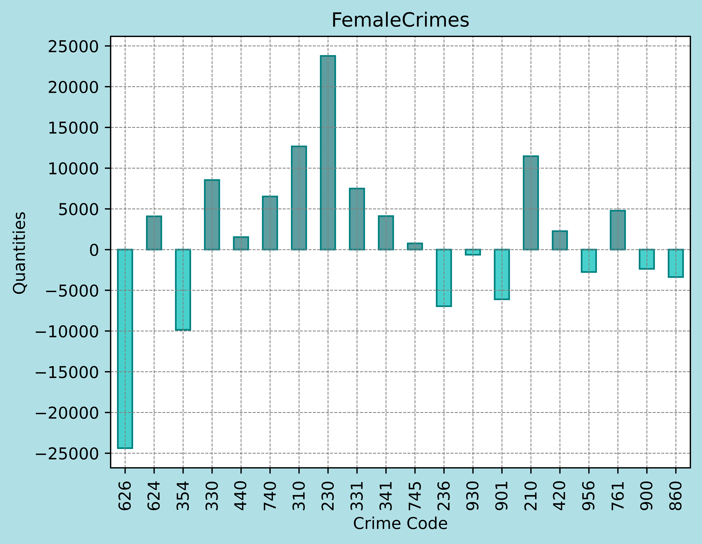

Hypothesis Three - Crime & Gender
=================================

A distribuição de crimes não é igual entre os gêneros, há crimes mais comuns
dependendo do sexo. 

Método
Dividiu-se em três análises os crimes mais ocorridos no geral, os mais ocorridos com os homens e os mais ocorridos 
com as mulheres

Colunas utilizadas:

* Crm Cd
* Vict Sex

Método:
Inicia

-----------------
Tabela dos Crimes
-----------------

==========  =========================================================
Crime Code   Crime Description
==========  =========================================================
210         ROBBERY
220         ATTEMPTED ROBBERY
230         ASSAULT WITH DEADLY WEAPON, AGGRAVATED ASSAULT
236         INTIMATE PARTNER - AGGRAVATED ASSAULT
310         BURGLARY
330         BURGLARY FROM VEHICLE
331         THEFT FROM MOTOR VEHICLE - GRAND ($950.01 AND OVER)
341         THEFT-GRAND ($950.01 & OVER)EXCPT,GUNS,FOWL,LIVESTK,PROD
354         THEFT OF IDENTITY
420         THEFT FROM MOTOR VEHICLE - PETTY ($950 & UNDER)
440         THEFT PLAIN - PETTY ($950 & UNDER)
442         SHOPLIFTING - PETTY THEFT ($950 & UNDER)
480         BIKE - STOLEN
624         BATTERY - SIMPLE ASSAULT
626         INTIMATE PARTNER - SIMPLE ASSAULT
740         VANDALISM - FELONY ($400 & OVER, ALL CHURCH VANDALISMS)
745         VANDALISM - MISDEAMEANOR ($399 OR UNDER)
761         BRANDISH WEAPON
860         BATTERY WITH SEXUAL CONTACT
888         TRESPASSING
900         VIOLATION OF COURT ORDER
901         VIOLATION OF RESTRAINING ORDER
930         CRIMINAL THREATS - NO WEAPON DISPLAYED
956         LETTERS, LEWD  -  TELEPHONE CALLS, LEWD
==========  =========================================================

