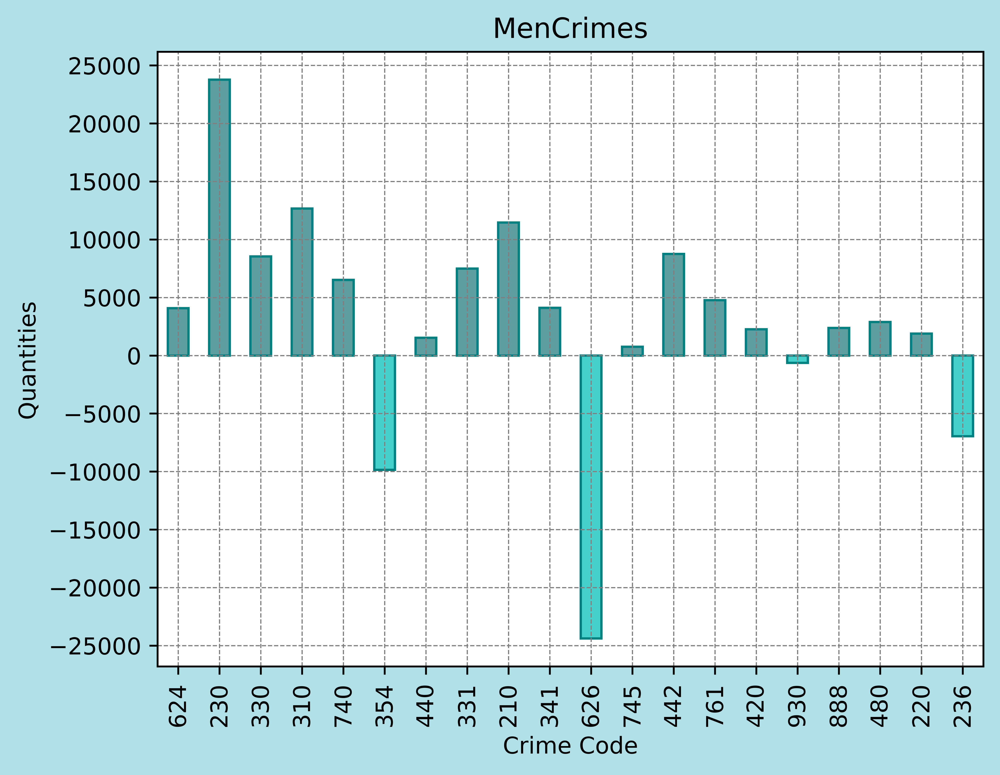
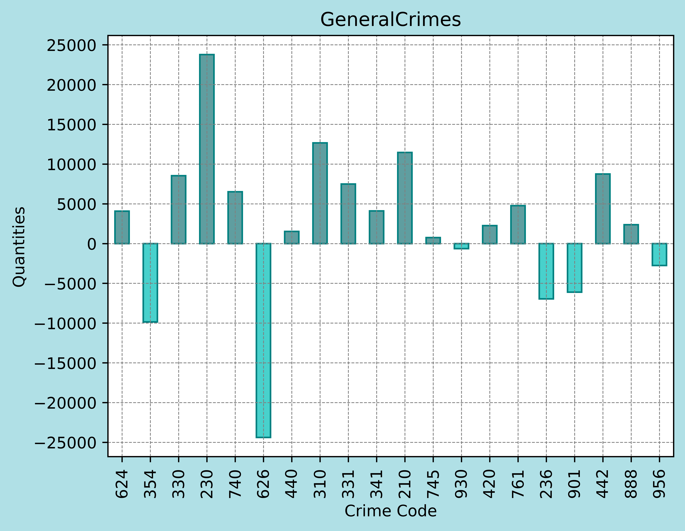
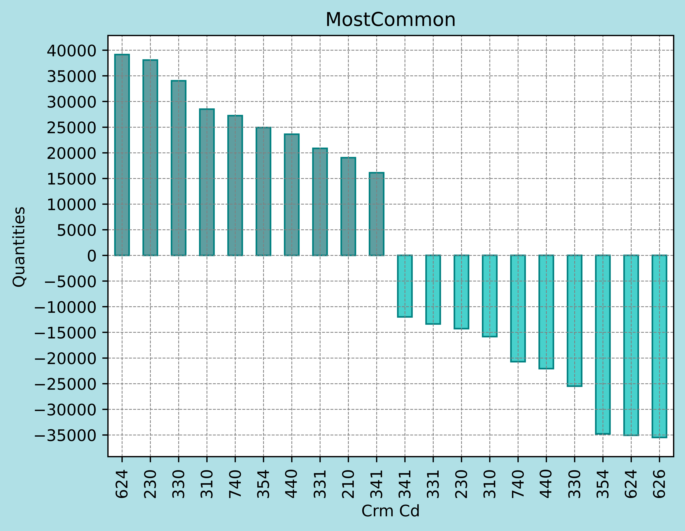

Hypothesis Three - Crime & Gender
=================================

The crime distruibution isn't equal between genders, certain crimes more common
depending on the sex.

Method
------

For data analysis, three distinct graphs were generated to highlight the disparity in
crime occurrences by gender, along with one graph that visualizes the highest occurrences 
based on gender.

The data represented in the graphs reflect the difference in the number of crimes committed. 
A positive value indicates a higher frequency of crimes committed against men, while a negative 
value points to a higher occurrence against women.

In the "GeneralCrimes" graph, the columns are ordered according to the crimes with the highest 
total occurrences, meaning those that were most reported in Los Angeles between 2020 and 2024, 
regardless of the victim's gender. This graph serves as a baseline for comparing crime occurrences 
related to a specific gender.

The "FemaleCrimes" and "MaleCrimes" graphs, on the other hand, have their columns organized according 
to the crimes most frequently committed against women and men, respectively. Additionally, there is the 
"MostCommon" graph, which visualizes the absolute values of crimes committed against both genders.

For the analysis of crimes against women, the "FemaleCrimes" graph was used to select the five crimes with 
the highest occurrences among women. Although the crimes are ordered by their frequency among women, it’s 
important to note that some of these crimes occur more frequently among men. For example, crime 654 is the 
second most common among women, but its incidence is even higher among men, which is why it wasn’t included 
in the female crime analysis. A similar approach was taken for the male crime analysis.

With these graphs, it’s possible to identify whether the high occurrence of a specific crime is associated 
with its prevalence across both genders or if it is targeted specifically at one. This distinction is crucial 
for structuring the hypothesis more precisely and for gaining a better understanding of the dynamics of 
gender-related crimes.

Columns Utilized
------------------

* Crm Cd (Crime Code)
* Vict Sex (Victim Sex)

Data
----

-----------------
Crime Table
-----------------

==========  =========================================================
Crime Code   Crime Description
==========  =========================================================
210         ROBBERY
220         ATTEMPTED ROBBERY
230         ASSAULT WITH DEADLY WEAPON, AGGRAVATED ASSAULT
236         INTIMATE PARTNER - AGGRAVATED ASSAULT
310         BURGLARY
330         BURGLARY FROM VEHICLE
331         THEFT FROM MOTOR VEHICLE - GRAND ($950.01 AND OVER)
341         THEFT-GRAND ($950.01 & OVER)EXCPT,GUNS,FOWL,LIVESTK,PROD
354         THEFT OF IDENTITY
420         THEFT FROM MOTOR VEHICLE - PETTY ($950 & UNDER)
440         THEFT PLAIN - PETTY ($950 & UNDER)
442         SHOPLIFTING - PETTY THEFT ($950 & UNDER)
480         BIKE - STOLEN
624         BATTERY - SIMPLE ASSAULT
626         INTIMATE PARTNER - SIMPLE ASSAULT
740         VANDALISM - FELONY ($400 & OVER, ALL CHURCH VANDALISMS)
745         VANDALISM - MISDEAMEANOR ($399 OR UNDER)
761         BRANDISH WEAPON
860         BATTERY WITH SEXUAL CONTACT
888         TRESPASSING
900         VIOLATION OF COURT ORDER
901         VIOLATION OF RESTRAINING ORDER
930         CRIMINAL THREATS - NO WEAPON DISPLAYED
956         LETTERS, LEWD  -  TELEPHONE CALLS, LEWD
==========  =========================================================

Gráfico i: 

.. figure:: ../../data/gender_and_crime/graphics/FemaleCrimes.png
   :width: 600px
   :height: 400px
   :align: center

Gráfico ii:

Gráfico iii:

Gráfico iv:

Análise
-------

Female:

626 (INTIMATE PARTNER - SIMPLE ASSAULT)
354 (THEFT OF IDENTITY)
236 (INTIMATE PARTNER - AGGRAVATED ASSAULT)
901 (VIOLATION OF RESTRAINING ORDER)
860 (BATTERY WITH SEXUAL CONTACT)

Men:

230 (ASSAULT WITH DEADLY WEAPON, AGGRAVATED ASSAULT)
310 (BURGLARY)
210 (ROBBERY)
330 (BURGLARY FROM VEHICLE)
442 (SHOPLIFTING - PETTY THEFT ($950 & UNDER))

Conclusion
-----------

Finally, the validity of the hypothesis is evident, given that crimes involving domestic violence in 
the analyses were clearly predominant with women as victims. The analysis reflects reality, as historically, 
society has developed under male dominance, where women assumed a submissive role. This shaped an ideology 
based on power relations, in which men objectified women as their property and, therefore, believed they had 
the right over women’s bodies. As a result, even today, abusive relationships are a reflection of this 
historical ideology, leading to an increase in crimes of violence against women. However, it is important to
note that not all crimes involving women stem explicitly from the logic of male dominance. For instance, 
crime 354 (see chart iii) occurs frequently with both men and women.

On the other hand, crimes against men arise more from a materialist logic, with a strong emphasis on theft and 
robbery, distinguishing them from the power dynamics present in violence against women. Nonetheless, physical 
violence is still present in these crimes, though it is not linked to control over the victim’s body and life as 
it is in the case of women. An example is the occurrence of crime 230, where a violent robbery occurs, but without 
a clear connection to gender.
